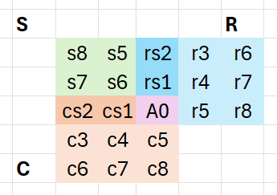
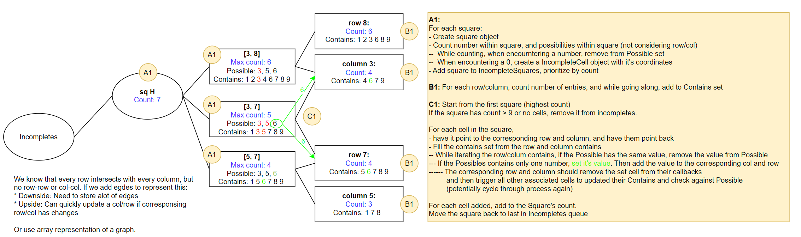

# Brainstorming Doc

## Idea 2: Set representation 
Use the suduko rules to construct the 
 

**Rules:**
* Entity: A set that can be Square, column, or row, 
    with nine unique values from 1 to 9.
* A cell belongs to three entities: 
  A Row (1x9), Column (9x1), and Square (3x3).
    * The Row and Column overlap once.
    * A Row/Column each overlap with the Square thrice. 

**Variables:**
* ``Line``: 1x9 or 9x1 Entity.
    * ``x``: Use for RowPtr
    * ``y``: Use fro ColPtr 
    * ``Contains``: Set of numbers in the line.

* ``Square``: 3x3 Entity.
    *   ``Cell``: cell within square.
        * ``x``: Use for RowPtr
        * ``y``: Use fro ColPtr
        * ``Possible``: Set of potential numbers.

**Set Resresentation:**

𝑆∩𝐶 = {a0, cs1, cs2}
𝑆∩𝑅 = {a0, rs1, rs2}
𝑆∩𝐶∩𝑅 = {a0}

𝐶 = {a0, cs1, cs2, c3, c4, c5, c6, c7, c8} = {1, 2, 3, 4, 5, 6, 7, 8, 9}
𝑅 = {a0, rs1, rs2, r3, r4, r5, r6, r7, r8} = {1, 2, 3, 4, 5, 6, 7, 8, 9}
𝑆 = {a0, rs1, rs2, cs1, cs2, s5, s6, s7, s8} = {1, 2, 3, 4, 5, 6, 7, 8, 9}

ALL = {a0, cs1, cs2, c3, c4, c5, c6, c7, c8, rs1, rs2, r3, r4, r5, r6, r7, r8, s5, s6, s7, s8}
ALL = (C ∪ R ∪ S)

**Implementation:**

Each non-filled cell has a thread that monitors what's possible for it.
* Set operations with **sorted arrays**: https://dotnettutorials.net/lesson/array-set-operations-in-c/
    * More human-readable, easier to test.
    * Merge operations are slower for large array
* Or use **bitmaps** to implement set operations. 
    * Set operations are much faster with bitwise operations. 
        If most operations are set-comparisons, bitmaps are more efficient than arrays.
    * Will take longer for translating the value, 
        and can waste space if the grid is large and the sets are sparse. 

## Idea 1: Graph Representation 
(And look into Constraint-Satisfaction Problems (CSP)).

Track values that are possible for a cell, as well
as the row/col/square they belong to with a graph. 

* **Create Column/Row Queue (``Lines``) for each non-complete row/column**
Each line is a pointer to the array position. 
- Cells are (x, y), or [row][column]
    - ``[n][0]``: Row ``n``. For row 0, ``n = -1``.
    - ``[0][n]``: Column ``n``. For column 0, ``n = -1``. 

1. While iterating through a line, add each encountered value to ``Contains``.
2. If ``Contains.size() < 9``, add the line to ``Lines``.

* **Create IncompleteSquares Queue**